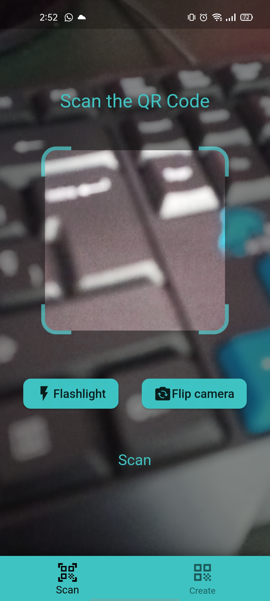
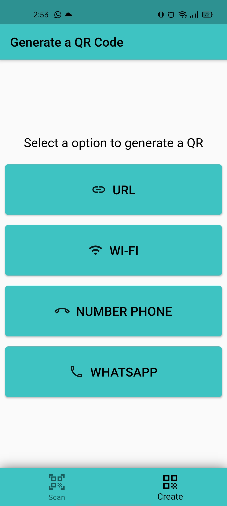
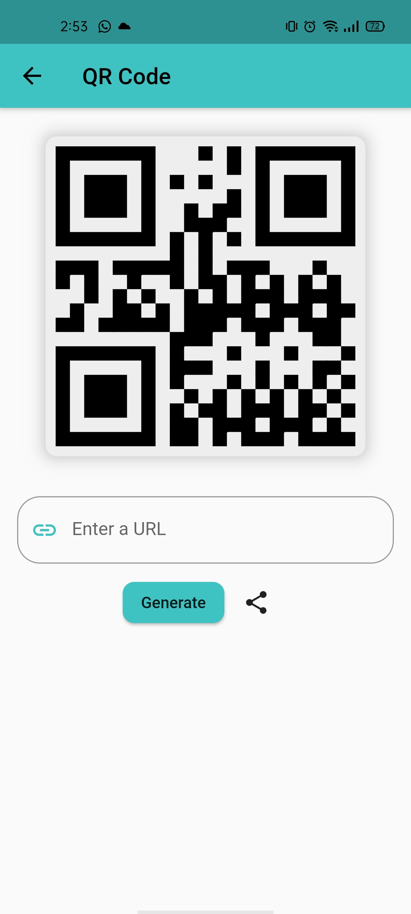
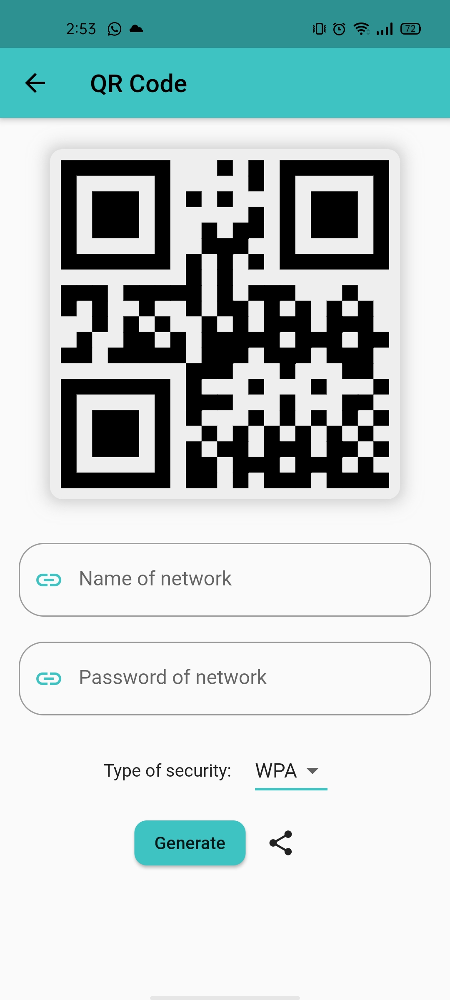
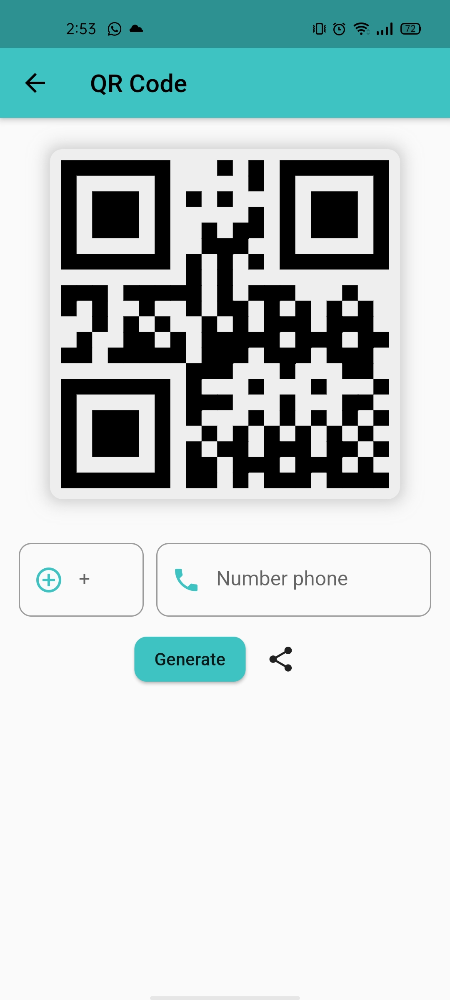

# qr_factory

A futter app to scan and generate a qr_code

## How to use

- Download the apk, click here:
- <a href="https://github.com/PedroHigueraG/qr_factory/raw/main/assets/QRFactory.apk" download="QRFactory.apk">Download apk</a>

- This is the main interface, in this interface you can scan your qr code and launch in the web or copy in the clipboard and flip the camera and use the flash

  

- The next interface is the menu to select the qr type

  

- URL QR, you need a link or text to generate a qr 

  

- Wifi QR, you need a wifi name, password and type of security to generate a qr 

  

- Number phone or whatsapp QE, you need a number phone and number of country to generate a qr 

  

